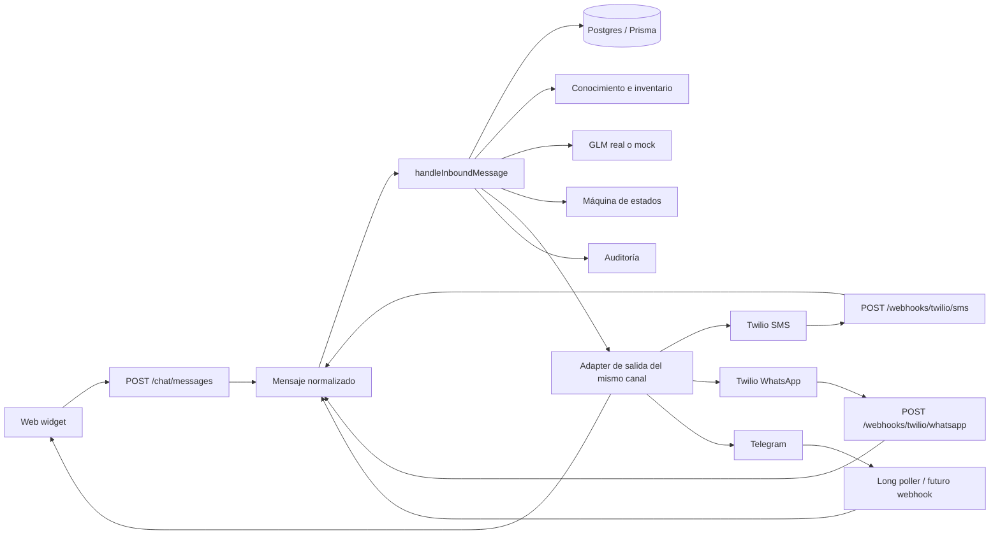
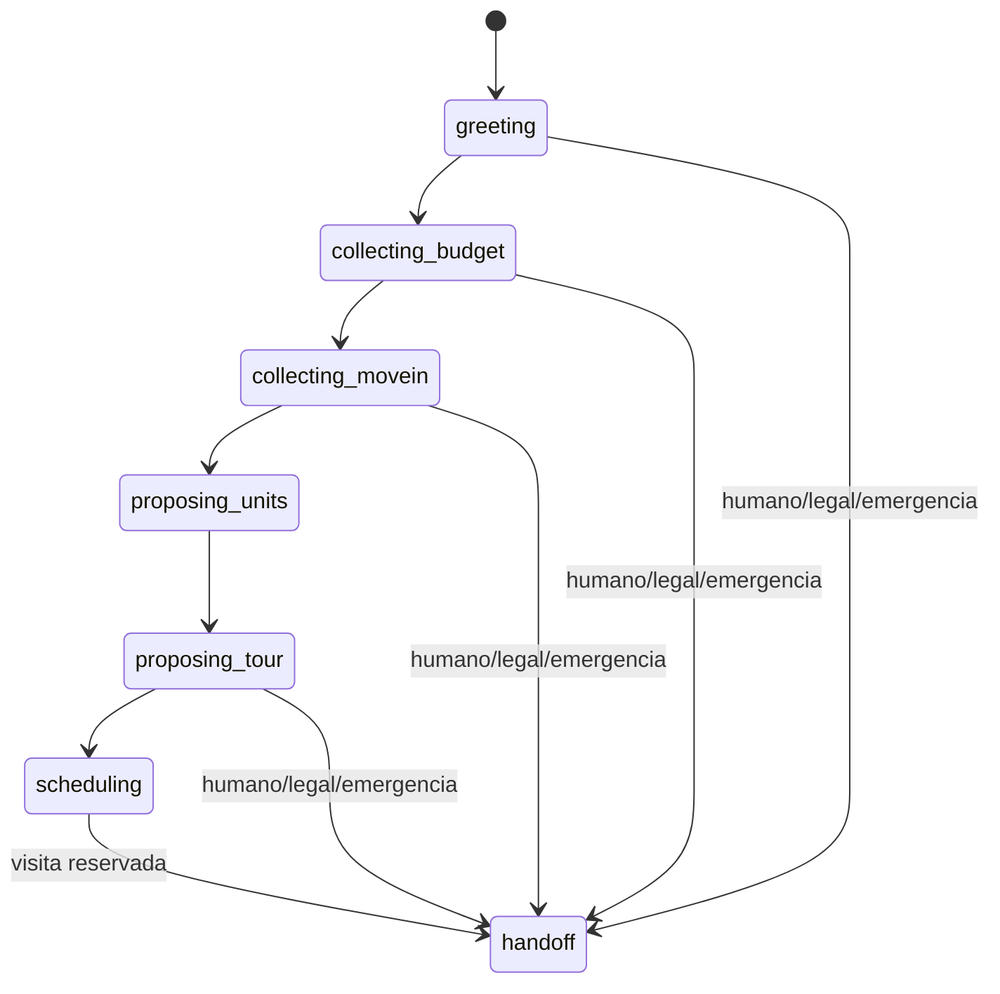
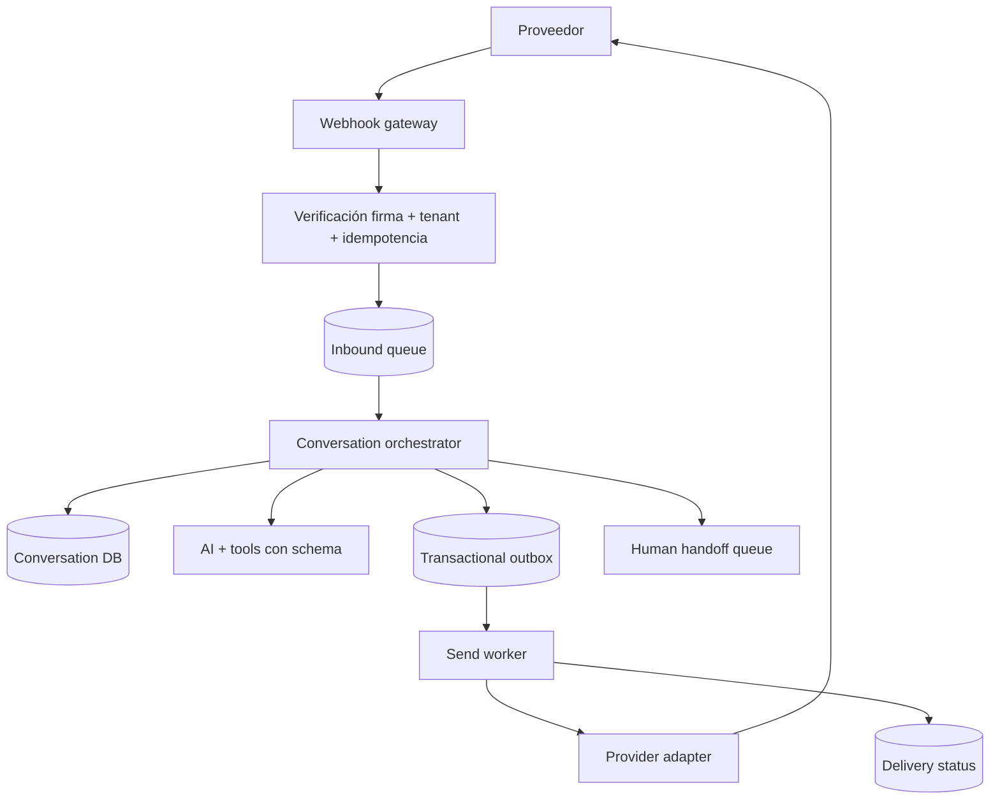

# Guía de transferencia: módulo de comunicación omnicanal

## Propósito de este documento

Este documento explica cómo se resolvió en **Property Manager** el núcleo de comunicación con prospectos para que otra IA pueda reproducirlo o adaptarlo en otro proyecto. Describe la arquitectura real del repositorio, el recorrido de los mensajes, el modelo de datos, las decisiones que evitaron errores, la configuración, las pruebas y las limitaciones actuales.

> **Aclaración terminológica:** la implementación actual es principalmente **omnicanal**: un mismo motor conversacional atiende web chat, Telegram, SMS y WhatsApp. También conserva URLs de archivos adjuntos recibidos por Twilio, pero todavía no interpreta imágenes, audio o video. Por eso no debe presentarse aún como un sistema multimodal completo. Email está modelado pero no tiene un proveedor real, y voz está investigado pero no implementado.

## 1. Resultado conseguido

Construimos un núcleo único que recibe mensajes normalizados desde varios canales y ejecuta siempre la misma lógica de negocio:

1. identifica tenant, canal y remitente;
2. obtiene o crea una conversación independiente por canal;
3. persiste el mensaje y recupera historial y slots;
4. consulta inventario y conocimiento del tenant;
5. llama a un modelo con salida JSON estructurada;
6. actualiza la máquina de estados y los datos extraídos;
7. recomienda unidades y puede iniciar la reserva de una visita;
8. crea o enlaza el lead;
9. envía la respuesta por el mismo canal;
10. registra auditoría y permite intervención humana desde el panel.

La idea central es que **los proveedores transportan mensajes, pero no contienen la lógica conversacional**. Twilio, Telegram y el web chat terminan llamando a `handleInboundMessage`. De esta forma, cambiar un proveedor o añadir un canal no obliga a duplicar el chatbot.

## 2. Arquitectura



### Capas y responsabilidades

| Capa | Responsabilidad | Ubicación principal |
|---|---|---|
| Contratos | Tipos comunes de entrada, salida y canal | `packages/adapters/src/contracts.ts` |
| Adapters | Traducir cada proveedor al contrato común | `packages/adapters/src/real`, `packages/adapters/src/mocks` |
| Factory | Elegir adapter real o mock desde variables de entorno | `packages/adapters/src/factory.ts` |
| Entradas HTTP/polling | Validar payload, resolver tenant y normalizar | `apps/api/src/routes`, `apps/api/src/jobs/telegram-poller.ts` |
| Orquestador | Persistencia, IA, FSM, leads, inventario, envío y auditoría | `apps/api/src/services/chatbot.service.ts` |
| Datos | Conversaciones, mensajes, slots, eventos y leads | `apps/api/prisma/schema.prisma` |
| Operación humana | Revisar conversaciones, responder, anotar, reasignar y hacer handoff | `apps/web/src/pages/ConversationsPage.tsx`, `apps/api/src/routes/chat.ts` |
| Web chat | UI anónima con sesión estable en el navegador | `apps/web/src/components/ChatWidget.tsx` |

## 3. Contrato común de mensajería

El desacoplamiento se logró con una interfaz común. Conceptualmente:

```ts
type ChatChannel = 'whatsapp' | 'sms' | 'telegram' | 'web' | 'email';

interface OutboundMessage {
  to: string;
  body: string;
  channel: ChatChannel;
}

interface InboundMessage {
  from: string;
  body: string;
  channel: ChatChannel;
  receivedAt: string;
  messageId: string;
  mediaUrls?: string[];
}

interface MessagingAdapter {
  readonly channel: ChatChannel;
  send(message: OutboundMessage): Promise<{ messageId: string }>;
  parseWebhook(headers: Record<string, string>, body: unknown): Promise<InboundMessage>;
}
```

Este contrato impide que el servicio central conozca campos como `From`, `Body`, `MessageSid`, `chat_id` o el prefijo `whatsapp:`. Esos detalles quedan encapsulados en el adapter.

### Por qué se conserva también un contrato específico de Twilio

SMS y WhatsApp comparten la API Messages de Twilio. El proyecto mantiene `TwilioAdapter` para hablar en términos nativos de Twilio y lo envuelve con `TwilioMessagingWrapper` para exponer `MessagingAdapter`. El wrapper:

- fija el canal;
- inyecta el remitente correcto (`TWILIO_SMS_FROM` o `TWILIO_WHATSAPP_FROM`);
- falla con un mensaje claro si falta el remitente en modo real;
- transforma la entrada Twilio a la forma común.

Esta composición evita duplicar el cliente HTTP de Twilio.

## 4. Selección real/mock

`createAdapters(env)` construye todas las integraciones. Si existen `TWILIO_ACCOUNT_SID` y `TWILIO_AUTH_TOKEN`, usa `TwilioRealAdapter`; de lo contrario usa `TwilioMockAdapter`. Lo mismo ocurre con GLM y Telegram.

El beneficio no es sólo facilitar pruebas. También permite desarrollar el recorrido completo —persistencia, FSM, lead, panel y auditoría— antes de disponer de cuentas externas.

Regla para trasladar al otro proyecto:

> La lógica de negocio nunca debe preguntar si está en modo mock. La factory entrega una implementación compatible y el resto del sistema opera contra contratos.

El provider queda cacheado como singleton en `apps/api/src/config/adapters.ts`. Para una versión multi-tenant madura, esta factory debe pasar de configuración global a resolución por tenant, leyendo credenciales cifradas de `IntegrationConfig`.

## 5. Entrada por canal

### 5.1 Web chat

El widget conserva un `sessionId` en `localStorage` y envía:

```http
POST /chat/messages
x-tenant-id: <tenant-id>
Content-Type: application/json

{
  "sessionId": "s_...",
  "message": "I need a two-bedroom apartment"
}
```

La API convierte la sesión en `from: web_<sessionId>`, usa el adapter web y devuelve `replyText` en la misma respuesta HTTP. El adapter web no llama a un proveedor externo; guarda los envíos en memoria para desarrollo y observabilidad básica.

### 5.2 Twilio SMS

Twilio debe apuntar a:

```text
POST {API_URL}/webhooks/twilio/sms
```

Express habilita `urlencoded`, porque Twilio envía formularios. La ruta exige al menos `From` y `Body`, normaliza el payload con el adapter y responde con TwiML vacío:

```xml
<Response></Response>
```

Esto confirma a Twilio que el webhook fue aceptado sin pedirle que genere otra respuesta. El chatbot ya envió el mensaje por la API REST de Twilio.

### 5.3 Twilio WhatsApp

Usa el mismo flujo mediante:

```text
POST {API_URL}/webhooks/twilio/whatsapp
```

Twilio representa direcciones como `whatsapp:+1604...`. El adapter elimina ese prefijo al recibir y lo añade al enviar. Así, el núcleo trabaja siempre con el teléfono canónico.

Existe además `/webhooks/twilio`, que autodetecta WhatsApp por el prefijo del campo `From`. Se conserva como endpoint de compatibilidad; los endpoints explícitos son preferibles porque eliminan ambigüedad.

Los campos `MediaUrl0`, `MediaUrl1`, etc. se ordenan y guardan en `ChatMessage.mediaUrls`. Actualmente no se descargan, autentican ni procesan con visión/audio.

### 5.4 Telegram

En desarrollo se usa `getUpdates` con long polling, porque no se presupone una URL pública. El poller:

1. valida el token con `getMe`;
2. pide updates con timeout largo;
3. avanza el `offset` para no releer updates dentro del mismo proceso;
4. normaliza cada texto;
5. lo envía a `handleInboundMessage`;
6. responde mediante `sendMessage`.

El proceso arranca desde `server.ts` sólo cuando existe `TELEGRAM_BOT_TOKEN`. Hay una ruta webhook preparada en `/chat/webhooks/telegram`, pero el adapter real actual declara explícitamente que funciona por polling. Al desplegar con dominio estable se debe reemplazar el polling por webhook o implementar `parseWebhook` real.

## 6. Identidad de conversación: la corrección más importante

Inicialmente, usar sólo el teléfono como `externalId` hacía que SMS y WhatsApp de una misma persona colisionaran. La solución fue construir la identidad externa así:

```ts
sms:+16045551792
whatsapp:+16045551792
telegram:12345678
web_<session-id>
```

La base impone unicidad en `(tenantId, externalId)`. Al responder manualmente, `getReplyAddressFromConversation` elimina el prefijo de canal antes de llamar al adapter.

Esta decisión conserva dos conceptos distintos:

- **conversación:** es específica del canal;
- **lead:** representa a la persona y puede enlazar varias conversaciones.

También se mantiene separado `Lead.source` de `Lead.preferredChannel`:

- `source` conserva el primer origen de adquisición;
- `preferredChannel` puede actualizarse cuando la persona cambia de canal.

No se debe sobrescribir el origen histórico cada vez que llega un mensaje.

## 7. Recorrido interno de un mensaje

### Paso 1: upsert de conversación

El orquestador calcula `externalId` y ejecuta un upsert por tenant y externalId. Recupera hasta 20 mensajes ordenados y todos los slots existentes.

### Paso 2: persistencia de entrada

Antes de llamar al modelo se guarda `ChatMessage` con `role: user`, texto y `mediaUrls`. Esto permite conservar el intento del usuario incluso si el modelo o el envío posterior fallan.

### Paso 3: contexto

El contexto entregado al modelo combina:

- estado actual;
- últimos mensajes de la conversación;
- slots ya extraídos;
- unidades activas del tenant;
- perfil de onboarding del tenant;
- documentos recientes;
- los cinco chunks de conocimiento con mejor ranking para la consulta.

El conocimiento y el inventario se consultan siempre con `tenantId`. Esa frontera es esencial en una aplicación SaaS.

### Paso 4: salida estructurada del modelo

El modelo recibe un JSON Schema con:

```json
{
  "reply": "string",
  "slots": {
    "budget": "string",
    "move_in_date": "string",
    "occupants": "string",
    "pets": "string",
    "preferred_area": "string"
  },
  "next_state": "greeting | collecting_budget | collecting_movein | proposing_units | proposing_tour | scheduling | handoff"
}
```

Se usa salida estructurada porque una respuesta de lenguaje natural no es suficiente para actualizar un proceso transaccional. Si el modelo o el parseo fallan, se devuelve una pregunta segura y se mantiene o avanza mínimamente el estado.

### Paso 5: persistencia de slots

Cada slot se guarda por upsert con unicidad `(conversationId, key)`. Por tanto, información posterior puede corregir presupuesto, fecha, mascotas, etc., sin duplicar filas.

### Paso 6: decisión determinista de negocio

La IA ayuda a comprender y dirigir el diálogo, pero no tiene control absoluto. El backend vuelve a consultar unidades y las puntúa de forma determinista:

- presupuesto: +30 si encaja, penalización si excede;
- área: +25;
- política de mascotas: +15;
- dormitorios frente a ocupantes: +10;
- mes de disponibilidad: +10.

Cuando el estado pasa a `proposing_tour`, el backend genera su propio texto con hasta tres unidades reales. Esto reduce alucinaciones: el modelo no inventa precios ni listings.

### Paso 7: scheduling

Al entrar en `scheduling`, el servicio obtiene horarios mediante el adapter ShowMojo, guarda temporalmente las opciones en los slots `pending_slots` y `scheduling_unit_id`, y pide al usuario responder con un número.

En el siguiente turno, parsea esa selección, agenda la visita y cambia a `handoff` para que el equipo confirme. En el MVP, ShowMojo puede ser mock; también existe creación manual de visitas desde el panel.

### Paso 8: estado, respuesta y lead

Se actualizan estado y unidad recomendada, se guarda el mensaje `assistant`, y se crea o enlaza el lead por `(tenantId, phone)`. Después se envía mediante el adapter del canal.

### Paso 9: auditoría

Se registra `chatbot.message_handled` con canal, nuevo estado, handoff, creación de lead y slots. Las acciones humanas relevantes se guardan además como `ConversationEvent`.

## 8. Máquina de estados



El prompt instruye tono profesional, respuestas de dos o tres frases, prohibición de asesoría legal/financiera y objetivo de calificar y agendar.

En modo mock, una implementación determinista extrae presupuesto, fecha, área, ocupantes y mascotas mediante expresiones regulares. También detecta intención de visita y palabras de handoff. Esto permitió probar el producto sin depender de disponibilidad o coste del modelo real.

## 9. Modelo de datos mínimo

### `ChatConversation`

- `tenantId`: frontera SaaS;
- `externalId`: identidad específica del canal;
- `channel`: canal de transporte;
- `state`: estado de la FSM;
- `unitId`: unidad recomendada o contextual;
- `leadId`: persona asociada;
- relaciones a mensajes, slots y eventos.

### `ChatMessage`

- `role`: `user`, `assistant`, `staff` o `system` por convención;
- `content`;
- `mediaUrls[]`;
- `createdAt`.

### `ConversationSlot`

Almacén flexible clave/valor para datos extraídos y estado auxiliar. Es adecuado para iterar rápidamente, aunque los slots críticos deberían tiparse o promoverse a columnas cuando el dominio se estabilice.

### `Lead`

Representa al prospecto entre canales. Conserva origen, canal preferido, estado comercial, unidad, responsable y estado operativo.

### `ConversationEvent`

Registra actividad operacional: notas internas, respuesta del staff, handoff, cambio de estado del lead, override de unidad y acciones de visitas. Se usa para la línea temporal del panel, no como sustituto del transcript.

## 10. Intervención humana

El panel autenticado permite:

- listar conversaciones del tenant;
- abrir transcript, slots, lead, unidad, eventos y visitas;
- enviar una respuesta manual por el canal original;
- cambiar la unidad recomendada;
- actualizar estado del lead;
- crear, confirmar, cancelar o reprogramar visitas;
- añadir notas internas;
- solicitar handoff.

Una respuesta manual se persiste con `role: staff`, genera un evento y usa exactamente el adapter indicado por `conversation.channel`. Esto evita que la UI tenga lógica específica de Twilio o Telegram.

El handoff manual pone la conversación en estado `handoff` y el lead en `needs_handoff`. Para producción falta una política explícita que bloquee cualquier nueva respuesta automática mientras ese estado siga activo; véase la sección de deuda técnica.

## 11. Multi-tenancy

La implementación actual mezcla dos niveles de madurez:

- todas las consultas operativas importantes llevan `tenantId` y el panel exige JWT;
- los canales compartidos de demo resuelven tenant mediante `TWILIO_DEFAULT_TENANT_ID` o `TELEGRAM_DEFAULT_TENANT_ID`.

Para un producto real por cliente, el diseño objetivo es:

1. almacenar credenciales cifradas por tenant en `IntegrationConfig`;
2. asignar cada número Twilio, sender de WhatsApp o bot token a un tenant;
3. resolver tenant por número receptor, webhook firmado/path opaco o credencial usada;
4. construir/cachear adapters por `(tenantId, provider, credentialVersion)`;
5. dejar de aceptar `x-tenant-id` desde fuentes públicas no confiables.

## 12. Configuración

Variables esenciales:

```dotenv
API_URL=https://api.example.com

TWILIO_ACCOUNT_SID=
TWILIO_AUTH_TOKEN=
TWILIO_SMS_FROM=
TWILIO_WHATSAPP_FROM=
TWILIO_DEFAULT_TENANT_ID=tenant_demo_pm

TELEGRAM_BOT_TOKEN=
TELEGRAM_DEFAULT_TENANT_ID=tenant_demo_pm

ZAI_API_KEY=
ZAI_BASE_URL=https://api.z.ai/api/paas/v4
GLM_REASONING_MODEL=glm-5.2
```

Con credenciales vacías se activan mocks. Nunca se debe versionar `.env` ni imprimir tokens.

En una URL pública estable, los targets son:

```text
SMS:       {API_URL}/webhooks/twilio/sms
WhatsApp:  {API_URL}/webhooks/twilio/whatsapp
Telegram:  {API_URL}/chat/webhooks/telegram   # cuando se implemente webhook real
Health:    {API_URL}/health
```

`GET /webhook-config` expone los targets calculados desde `API_URL`, lo que reduce errores al configurar consolas externas.

## 13. Cómo añadir otro canal

La otra IA debería seguir este orden:

1. añadir el nuevo literal a `ChatChannel` y al enum Prisma;
2. crear migración;
3. implementar `MessagingAdapter` real y mock;
4. registrar ambos en la factory;
5. crear el punto de entrada del proveedor y validar su payload;
6. verificar firma, timestamp y replay protection antes de normalizar;
7. resolver el tenant desde una identidad confiable del canal;
8. llamar a `handleInboundMessage` sin duplicar lógica;
9. añadir el canal al cálculo de `externalId` y al stripping de dirección;
10. mapear origen y canal preferido del lead;
11. habilitar respuesta manual desde el panel;
12. añadir pruebas de parsing, envío, separación de identidad, routing y errores.

Para email, por ejemplo, `from` no debería ser sólo la dirección: conviene decidir si el hilo se identifica por `Message-ID`/`References`, asunto normalizado o persona, según la experiencia deseada.

Para voz, no se debe tratar el audio como un mensaje de texto largo. Se necesita una sesión realtime, eventos parciales, interrupciones, latencia, streaming, telephony y una estrategia para convertir la sesión final en transcript/eventos compatibles con el núcleo.

## 14. Pruebas que sostienen el diseño

El repositorio incluye pruebas para:

- separación SMS/WhatsApp aun con el mismo teléfono;
- eliminación del prefijo antes de responder;
- conservación de `source` y actualización de `preferredChannel`;
- ranking determinista de unidades;
- routing explícito de Telegram y Twilio;
- fallback al tenant demo;
- presencia de parsing `urlencoded` y TwiML vacío;
- parsing de webhooks SMS y WhatsApp;
- prefijos WhatsApp al enviar;
- autenticación Basic y cuerpo form-urlencoded de Twilio;
- propagación de errores útiles de Twilio;
- FSM mock y extracción de datos;
- eventos, timeline y actividad operacional.

Comandos de verificación:

```powershell
pnpm test
pnpm typecheck
pnpm build
pnpm test:smoke
```

Para un port, conviene empezar con pruebas de contrato de adapter y luego una prueba end-to-end por canal que verifique: webhook → conversación → mensaje → lead → respuesta saliente.

## 15. Decisiones acertadas que conviene conservar

1. **Un solo orquestador:** impide divergencia funcional entre canales.
2. **Normalización en el borde:** el dominio no conoce payloads del proveedor.
3. **Conversación específica del canal, lead transversal:** evita colisiones sin perder visión unificada de la persona.
4. **Salida JSON estructurada:** convierte lenguaje en cambios de estado verificables.
5. **IA para comprensión, reglas para hechos y acciones:** inventario, ranking y agenda se controlan en backend.
6. **Mocks con el mismo contrato:** habilitan desarrollo y demos reproducibles.
7. **Persistir antes de enviar:** mantiene trazabilidad ante fallos externos.
8. **Intervención humana dentro del mismo modelo:** el staff no crea un sistema paralelo.
9. **Separar sender SMS y WhatsApp:** ambos usan Twilio, pero requieren identidades y configuración distintas.
10. **Auditoría separada de transcript:** una conversación explica qué se dijo; los eventos explican qué hizo el sistema o el staff.

## 16. Limitaciones y deuda técnica

La otra IA no debe copiar estas simplificaciones como si fueran decisiones de producción:

### Seguridad de webhooks

- Twilio SMS/WhatsApp valida `X-Twilio-Signature` con HMAC-SHA1 y comparación timing-safe cuando `TWILIO_AUTH_TOKEN` está configurado.
- En modo Twilio real se usa `TWILIO_DEFAULT_TENANT_ID`; no se acepta que un header público `x-tenant-id` cambie el tenant.
- El endpoint Telegram de webhook no tiene secreto real implementado.

Pendiente: resolución por número receptor/configuración de integración cuando haya números por tenant y protección equivalente para el futuro webhook de Telegram.

### Idempotencia

Los webhooks Twilio reclaman `MessageSid` en `webhook_receipts` mediante un índice único por tenant/proveedor y estados `processing`/`completed`/`failed`. Un retry ya procesado recibe el mismo TwiML vacío sin crear otra respuesta; un retry concurrente o fallido recibe `409`. Los fallos quedan registrados para reproceso manual controlado, evitando que un retry automático repita efectos parciales o envíos. Cada concesión usa un `claimToken` y todas las operaciones usan el contexto RLS del tenant. La garantía actual es **at-most-once**, no exactamente una vez. Pendiente: transactional outbox para entrega recuperable, política de retención/limpieza y extender el patrón a otros proveedores.

### Transacciones y fallos parciales

El recorrido hace múltiples escrituras y después un envío externo. Puede quedar respuesta persistida pero no enviada, o lead creado sin auditoría. Aplicar patrón transactional outbox:

1. transacción de estado + mensaje + evento + outbox;
2. worker envía;
3. guarda estado `sent/failed`, provider ID y reintentos;
4. dead-letter queue y alerta tras fallos repetidos.

### Handoff

El estado `handoff` está modelado, pero `handleInboundMessage` no corta automáticamente la IA cuando llega un nuevo mensaje. Añadir `automationPausedAt`, razón, responsable y reglas de resume/close.

### Privacidad y cumplimiento

Faltan políticas implementadas de consentimiento, opt-out SMS, retención, borrado, clasificación de PII y acceso a media. Para Canadá deben validarse CASL, privacidad provincial/federal y reglas específicas del proveedor con asesoría competente.

### Multi-tenancy de proveedores

Los adapters se configuran globalmente y el bot/números demo apuntan a un tenant por defecto. En producción deben resolverse por tenant y destinatario.

### Multimodalidad

Sólo se conservan URLs. Para imágenes/audio se necesita:

- descarga autenticada y con límites;
- allowlist de MIME y tamaño;
- antivirus/sandbox;
- almacenamiento propio con expiración;
- OCR/STT/visión;
- provenance del resultado;
- prompt-injection defenses para contenido adjunto;
- revisión humana en decisiones sensibles.

### Observabilidad

Faltan métricas estructuradas de latencia, tokens/coste, delivery status, retries, handoffs, conversión y errores por canal. Los `console.log` no bastan.

### Escalabilidad de Telegram

El offset vive en memoria. Un reinicio o múltiples réplicas pueden causar repeticiones/conflictos. Persistir offset o, preferiblemente, usar webhook en producción.

### Identidad de personas

El enlace de leads usa teléfono y no siempre filtra tenant en todas las búsquedas auxiliares del scheduling. Toda búsqueda de identidad debe incluir tenant y usar normalización E.164. Para Telegram/web/email hace falta una tabla explícita `ChannelIdentity`.

## 17. Diseño recomendado para la siguiente versión



Separar recepción, procesamiento y envío permite responder rápidamente al webhook, absorber picos, reintentar y evitar que una latencia del modelo provoque timeout del proveedor.

## 18. Instrucciones directas para la IA que hará el port

1. Inspecciona primero el dominio del proyecto destino: entidades, multi-tenancy, autenticación y acciones permitidas.
2. No copies nombres de Property Manager si el funnel es distinto; conserva el patrón y redefine estados/slots.
3. Implementa contratos y mocks antes de conectar proveedores.
4. Diseña la identidad como `(tenant, channel, external party/thread)` y la persona como entidad separada.
5. Haz que todos los canales produzcan el mismo `InboundMessage`.
6. Mantén una sola función de orquestación independiente del proveedor.
7. Obliga al modelo a emitir schema y valida nuevamente en backend.
8. No permitas que la IA invente entidades, precios, disponibilidad o permisos; usa tools/consultas reales.
9. Persiste transcript, estado, slots, eventos y provider IDs.
10. Implementa idempotencia y outbox antes de tráfico real.
11. Implementa handoff como pausa real de automatización, no sólo como etiqueta.
12. Verifica firma y tenant en cada webhook.
13. Prueba primero con mocks, después sandbox y finalmente un número/cuenta de staging.
14. Añade dashboards de delivery, latencia, coste y handoff.
15. Si el nuevo proyecto necesita multimodalidad, añade un pipeline de media separado; no incrustes archivos arbitrarios directamente en el prompt.

## 19. Checklist de aceptación para el otro proyecto

- [ ] Un mismo usuario puede hablar por dos canales sin mezclar transcripts.
- [ ] Las conversaciones pueden unificarse bajo una persona/lead.
- [ ] Un webhook repetido no produce dos respuestas.
- [ ] El tenant se resuelve sin confiar en headers controlados por el público.
- [ ] La firma del proveedor se valida sobre el cuerpo original.
- [ ] El mensaje entrante queda persistido aunque falle la IA.
- [ ] Un fallo de envío queda visible y se reintenta.
- [ ] El staff puede pausar, responder y reanudar automatización.
- [ ] La IA usa conocimiento e inventario del tenant correcto.
- [ ] Las acciones sensibles se validan en código.
- [ ] Adjuntos se validan, almacenan y procesan de forma segura.
- [ ] Hay pruebas de contrato por adapter y E2E por canal.
- [ ] Hay métricas de delivery, latencia, coste, handoff y conversión.

## 20. Mapa de archivos de referencia

Para reconstruir la implementación original, leer en este orden:

1. `packages/adapters/src/contracts.ts`
2. `packages/adapters/src/factory.ts`
3. `packages/adapters/src/real/twilio.real.ts`
4. `packages/adapters/src/real/telegram.real.ts`
5. `apps/api/src/routes/webhooks.ts`
6. `apps/api/src/routes/chat.ts`
7. `apps/api/src/services/chatbot.service.ts`
8. `apps/api/prisma/schema.prisma`
9. `apps/api/src/jobs/telegram-poller.ts`
10. `apps/web/src/components/ChatWidget.tsx`
11. `apps/web/src/pages/ConversationsPage.tsx`
12. pruebas `*.test.ts` relacionadas con Twilio, routing, chatbot y eventos.

## Conclusión

La solución no consistió en crear cuatro chatbots. Consistió en crear **un único sistema conversacional con puertos de entrada y salida intercambiables**, identidad de conversación específica por canal, persistencia común, estado estructurado, conocimiento tenant-scoped, acciones deterministas y una superficie de intervención humana.

Ese es el patrón que debe trasladarse. Los proveedores concretos pueden cambiar; el valor arquitectónico está en la normalización, el desacoplamiento, la trazabilidad y el control de las decisiones fuera del modelo.
